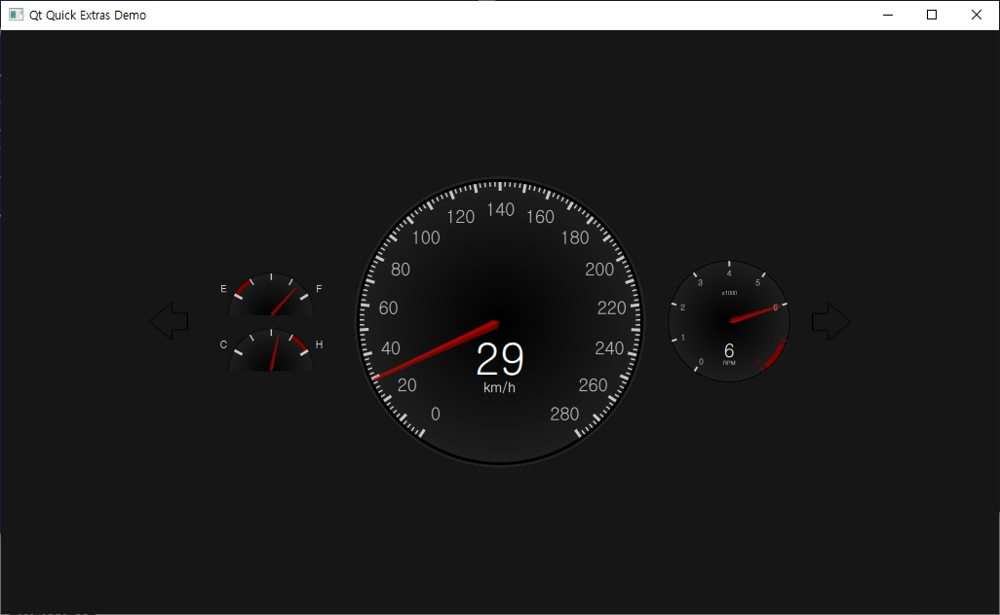

# Qt dashboard

## Example



- Qt dashboard is a example of Qt.

- `Qt\Examples\Qt-5.13.0\quickcontrols\extras\dashboard`

## How to test

1. Using Qt Creator
	1. execute qt-creator
	2. load 'dashboard.pro'
	3. compile and execute

2. Using QML Scene
	1. Start Qt Command
	2. cd qt-dashboard\dashboard\qml
	3. execute command
	```
	qmlscene dashboard.qml
	```

## Tech.

- Qt QML (Qt 5.13)
	- QtQuick 2.2
	- QtQuick.Window 2.1
	- QtQuick.Controls 1.4
	- QtQuick.Extras 1.4
	- QtQuick.Controls.Styles 1.4

```diff
- This project is not available in Qt6 due to QML version difference.
```

## License

- This example is part of the examples of the Qt Toolkit. : Copyright (c) The Qt Company Ltd.

- DejaVu Sans font : Copyright (c) Bitstream, Inc. All Rights Reserved.

- Some code is fixed by j2doll.	

## Similar projects

### Qt automotive


- https://github.com/JayTwoLab/qt-automotive

- Qt automotive is a example of Qt.

### Modern Dashboard (ex)


- https://github.com/JayTwoLab/dashboard-modern.ex

- forked from yuq/dashboard-modern

- RadarScanEffect

### dashApp.kr


- https://github.com/JayTwoLab/dashApp.kr

- Automotive digital dashboard on Qt for Hyundai Elantra XD GLS

- forked from [demitov/dashApp](https://github.com/demitov/dashApp)


